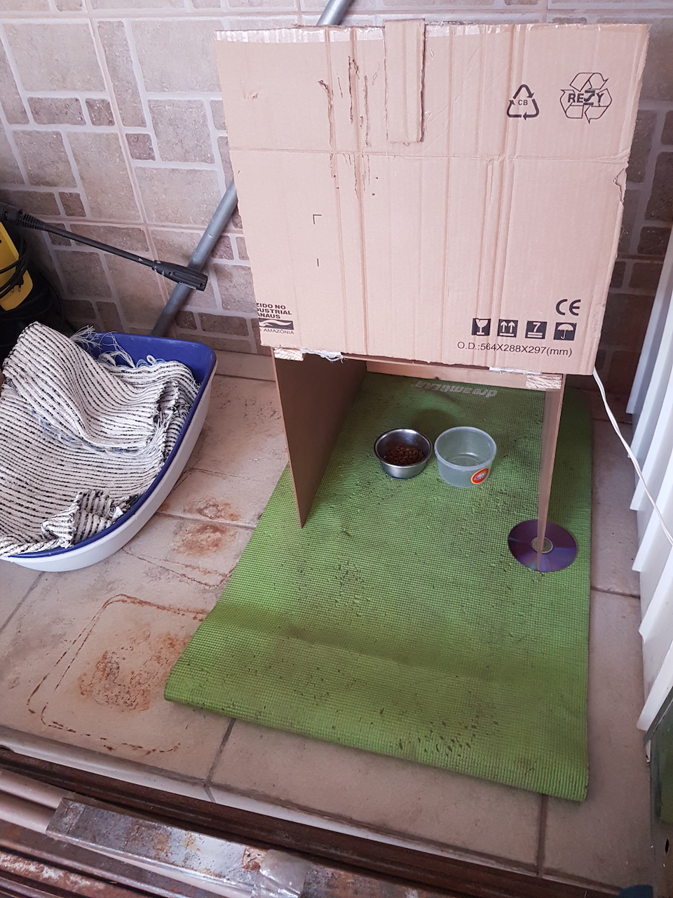
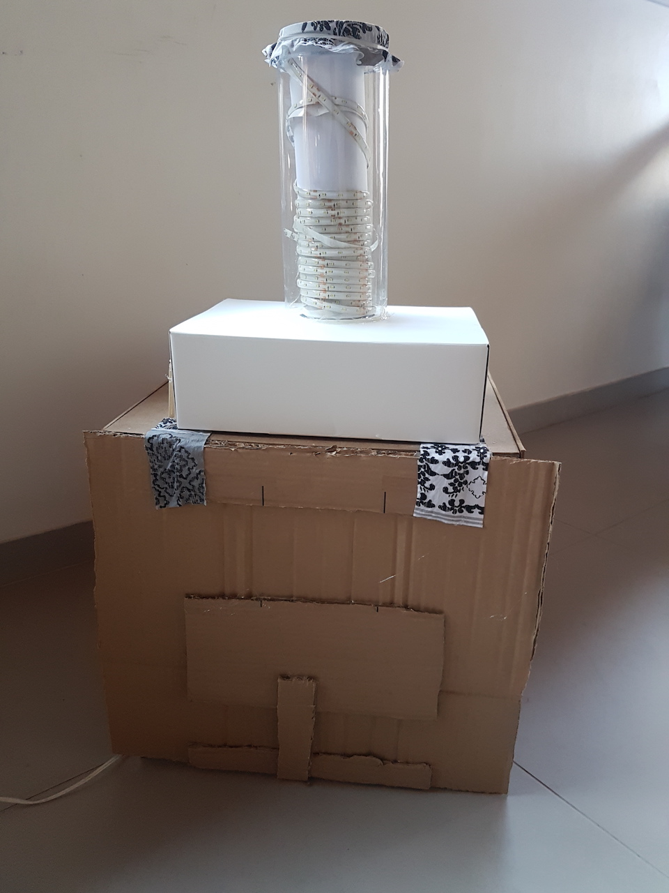

# Stop the Pigeon 2000

Inspiration: <https://youtu.be/sj6-LG5VpGk>

The STP2000 is a machine to stop pigeons to eat my neighbor's cat food.

Yes, it's a prototype, developed using raspberrypi 4, few sensors and actuators.